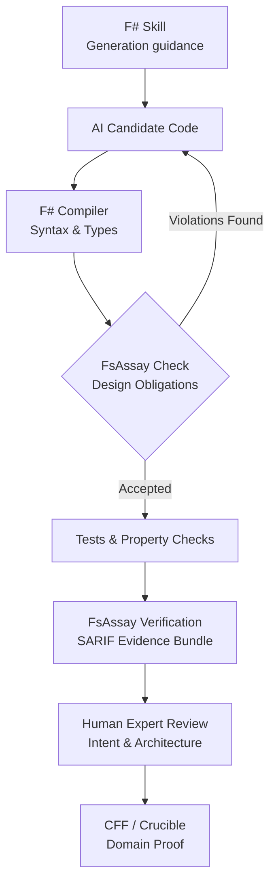

# FSharpAssay (FsAssay) 🧪

> **FsAssay is a compiler-backed F# design critic for humans and coding agents—strict about mechanical truth, explicit about architectural opinion, and honest about uncertainty.**

---

## 🧭 The 5W1H of FsAssay

| Question | Enterprise Real-World Answer |
| :--- | :--- |
| **What?** | A compiler-aware F# design critic that checks whether code merely compiles or genuinely follows the repository's functional architecture. |
| **Why?** | The F# compiler permits mutation, null, inheritance, partial functions, and mixed paradigms. Agents trained predominantly on C# will use them unless guided and checked. |
| **Who?** | AI coding agents first; F# newcomers second; senior F# reviewers, architects, and maintainers third. |
| **When?** | After every agent edit, before PR submission, during CI verification, and before evidence/release packaging. |
| **Where?** | Agent harness, CLI, IDE extension, CI pipeline, and training-data generation pipelines. |
| **How?** | Skills guide generation; compiler checks language correctness; FsAssay checks design obligations; tests check behavior; CFF/Crucible checks domain truth. |

---

## ⚡ Skills vs. FsAssay: Complementary Halves

Skills and FsAssay solve different halves of the agentic coding problem:

| Capability | F# Agent Skill | FsAssay Critic |
| :--- | :---: | :---: |
| **Tells the agent what good F# looks like** | Yes | Via diagnostic remediations (`--fix`) |
| **Prevents C#-shaped code generation** | Improves probability | Detects observable violations |
| **Can be ignored by the model** | Yes | Not when enforced by CI / Harness |
| **Understands resolved F# symbols** | No | Yes (via FCS / TAST) |
| **Produces machine-verifiable evidence** | No | Yes (OASIS SARIF v2.1.0) |
| **Measures architectural improvement** | Weakly | Yes (Grades S to F, Rate Cards) |
| **Provides training feedback** | Examples & instructions | Rejection labels & counterexamples |
| **Requires human interpretation** | Often | Deterministic rules: No; Contextual: Profile-gated |

> **"A Skill is the textbook. FsAssay is the examiner."**
> 
> *The compiler asks: "Does this compile?" FsAssay asks: "Did the agent produce the kind of F# this repository intended?"*

---

## 🏢 Real-World Enterprise Workout Example

Consider an AI agent building an order-processing service.

**The Skill instructs the agent:**
Use `OrderId` and `CustomerId` domain types • Model states using DUs • Return `Result` • Keep I/O in the shell • Avoid partial access and hidden exceptions.

**The Agent nevertheless generates:**
```fsharp
let processOrder (orderId: string) (customerId: string) =
    let customer = repository.find customerId |> Option.get
    let mutable total = 0m

    for item in customer.Items do
        total <- total + item.Price

    total
```

*This compiles cleanly, so the compiler cannot protect the architecture.*

**FsAssay responds at multi-level confidence:**
- ❌ **BLOCK (`FSA-C02` / `FSA1002`)**: Resolved call to `Option.get` creates an unguarded partial function.
- ❌ **BLOCK under `core` (`FSA1001`)**: Mutation (`let mutable`) is strictly forbidden in the functional core.
- ⚠️ **ADVISE (`FSA1004`)**: Two string parameters (`orderId: string`, `customerId: string`) indicate primitive blindness.
- 💡 **ADVISE (`FSA1007`)**: Iterative accumulation loop could be expressed idiomatically using `List.sumBy`.
- ❓ **INCONCLUSIVE (`FSA1301`)**: Direct `repository` access requires boundary profile verification (`shell` vs `core`).

Now the agent repairs the code in the background loop before a human reviewer sees it. The senior architect concentrates on concurrency, transaction semantics, and business correctness—not repetitive F# syntax correction.

---

## 📉 Human Review Overhead Reduction

| Review Category | Skills Only | Skills + Trustworthy FsAssay |
| :--- | :--- | :--- |
| **Basic F# Idiom Correction** | Reduced somewhat | **Largely Automated** |
| **Partial / Null / Mutation Filtering** | Human still verifies | **Mechanically Filtered** |
| **Repeated Agent Repair Cycles** | Prompt-driven | **Evidence-Driven (`--fix`)** |
| **Architecture Boundary Review** | Mostly human | **Pre-Classified by Profiles** |
| **Domain & Business Correctness** | Human | **Human Expert** |
| **Performance & Operational Design** | Human | **Human Expert** |

### 🎯 Initial Impact Targets
- **50–80%** reduction in repetitive idiom-review comments.
- **30–50%** reduction in agent repair cycles.
- **20–35%** reduction in total expert F# review time.
- **Substantial** improvement in code consistency across large multi-agent teams.

---

## 🔄 The Complete Agentic Verification Loop



---

## 🚀 The Dataset & Training Flywheel

FsAssay addresses the shortage of public F# training data in two ways:
1. **Short Term**: Corrects weak agent output today via deterministic feedback loops.
2. **Long Term**: Creates high-quality F# training datasets for tomorrow:

```
1. Collect Bad AI Candidates ──> 2. Record Exact FsAssay Findings ──> 3. Store Corrected F# Code
                                                                                 │
6. Keep FsAssay as Judge    <── 5. Fine-Tune / LoRA & Prompt Eval <── 4. Produce Accepted / Rejected Pairs
```

---

## 🎯 The Three Pillars of FsAssay

### 1. 🔍 Strict About Mechanical Truth
- **Compiler-Backed Precision**: Built directly on `FSharp.Compiler.Service` (FCS) and `FSharp.Analyzers.SDK`. Operates on typed AST (TAST) trees rather than crude text matching.
- **Exact Source Ranges**: Every finding points to exact line and column coordinates (`Range.StartLine`, `Range.StartColumn`) for seamless editor diagnostics.
- **Zero Comment & String False Positives**: Lexical comments and string literals containing reserved keywords (`mutable`, `null`, `while`) are automatically sanitized.

### 2. 🏛 Explicit About Architectural Opinion
- **Functional-First Profile Matrix**: Recognizes that real-world applications need pragmatism at boundaries while demanding total functional purity in core domains.
  - **`core`**: Zero-tolerance functional purity for core domain logic.
  - **`shell`**: Permits infrastructure and ORM persistence adapters (EF Core).
  - **`interop`**: Permits C# interop pragmatism (`mutable`, `null`, `ResizeArray`).
  - **`script`**: Permits `.fsx` scripting idioms (`while` loops, synchronous blocking).
  - **`performance`**: Permits measured local hot-path mutability.

### 3. ⚖️ Honest About Uncertainty
- **Four-State Verdict Kernel**: Classifies analysis outputs explicitly into `Pass`, `Fail`, `Inconclusive`, or `ToolFailure` with non-zero CLI exit codes.
- **SARIF v2.1.0 Evidence Bundles**: Exports standardized OASIS SARIF output alongside Markdown Rate Cards (Grades S–F) and Material Design 5 Dashboards.

---

## 📊 Complete Rule Catalogue Matrix (42/42 Verified Tests)

### 🔴 Tier 1: SOTA Correctness Rules (`FSA-C01` – `FSA-C08`)

| Rule ID | Rule Name | Description | Elite F# Alternative |
| :--- | :--- | :--- | :--- |
| **`FSA-C01`** | **`Unchecked.defaultof<_>`** | Using `Unchecked.defaultof<_>` outside interop boundary. | Return `Option<'T>` or proper discriminated union initialization. |
| **`FSA-C02`** | **Partial Access / `.Value`** | Calling `Option.get`, `.Value`, or `List.head` without guards. | Use pattern matching (`match opt with Some v -> ...`). |
| **`FSA-C03`** | **Async Blocking in Library** | Using `Async.RunSynchronously` inside reusable library code. | Flow `async { ... }` or `task { ... }` computation expressions. |
| **`FSA-C04`** | **Async Disposed Leak** | `use` resource bound before `Async.Start` finishes. | Pass `CancellationToken` or use `Async.StartImmediate`. |
| **`FSA-C05`** | **Incomplete DU Pattern Match** | Non-exhaustive pattern matching missing cases or wildcard `\| _ ->`. | Match all Discriminated Union cases explicitly. |
| **`FSA-C06`** | **Exceptions in Public API** | Throwing `failwith` / `raise` in public functions. | Return `Result<'T, 'Error>` error channels. |
| **`FSA-C07`** | **Non-Tail Recursion** | Self-referential recursive call in non-tail position. | Convert to tail-recursive accumulator or `Seq.fold`. |
| **`FSA-C08`** | **`Seq.length` on Infinite Seq** | Evaluating `Seq.length` on `Seq.initInfinite` or `Seq.unfold`. | Use `Seq.truncate` or bounded collection streams. |

---

### 🟠 Tier 2: SOTA Security & Guardrail Rules (`FSA-S01` – `FSA-S05`)

| Rule ID | Rule Name | Description | Elite F# Alternative |
| :--- | :--- | :--- | :--- |
| **`FSA-S01`** | **Hard-Coded Secrets** | Embedded API keys, AWS tokens (`AKIA...`), or passwords. | Inject credentials from environment variables or secret vaults. |
| **`FSA-S02`** | **Path Traversal** | Unsanitized file path input containing relative parent `..`. | Normalize and validate paths with `Path.GetFullPath`. |
| **`FSA-S03`** | **Swallowed Exceptions** | Empty `try ... with _ -> ()` or `with _ -> ignore()`. | Handle specific exceptions or propagate as `Error` results. |
| **`FSA-S04`** | **`async` Missing `return`** | `async { ... }` computation expression omitting explicit return. | Always end async blocks with explicit `return` or `return!`. |
| **`FSA-S05`** | **Task Blocking Calls** | Calling `.Result` or `.Wait()` on .NET `Task` instances. | Use `let! res = task |> Async.AwaitTask`. |

---

### 🟢 Core Functional Anti-Patterns (`FSA1001` – `FSA1401`)

| Rule Code | Name | Description | Elite F# Alternative |
| :--- | :--- | :--- | :--- |
| **`FSA1001`** | **Mutation Overuse** | Unnecessary `mutable` variables or assignment (`<-`). | Use immutable record copy syntax (`{ r with Field = v }`). |
| **`FSA1002`** | **Partial Access** | Calling `.Value`, `Option.get`, or `.Head`. | Use pattern matching or `Option.map`. |
| **`FSA1003`** | **Null Reference** | Returning or assigning raw `null`. | Return `Option<'T>`. |
| **`FSA1004`** | **Primitive Obsession** | Using primitive type aliases (`type Email = string`). | Use Single-Case Discriminated Unions (`type Email = Email of string`). |
| **`FSA1005`** | **Boolean Validation** | Returning `bool` from validation functions. | Return `Result<ParsedType, Error>` (Parse, Don't Validate). |
| **`FSA1006`** | **Generic Catch** | Catching `System.Exception` generically. | Use `Result` returning functions. |
| **`FSA1007`** | **Imperative Loops** | Using `while` loops for iteration/aggregation. | Use `Seq.fold`, `Seq.map`, or recursion. |
| **`FSA1008`** | **OOP Inheritance** | Using `inherit`, `abstract`, or `interface ... with`. | Compose functions or use Discriminated Unions. |
| **`FSA1009`** | **Mutable Collections** | Using `ResizeArray` or `List<'T>`. | Use F# immutable `list`, `array`, `Set`, or `Map`. |
| **`FSA1101`** | **Async Blocking** | Synchronous blocking via `Async.RunSynchronously`. | Use `let!` inside async computation expressions. |
| **`FSA1201`** | **Unbounded Materialization** | Materializing infinite sequences (`Seq.toList`). | Truncate sequences before materialization. |
| **`FSA1301`** | **EF Core Domain Leak** | EF Core / ORM dependencies in domain models. | Isolate persistence logic to the infrastructure shell. |
| **`FSA1401`** | **Unbounded Async Start** | Launching `Async.Start` without `CancellationToken`. | Pass `CancellationToken` or use `Async.StartImmediate`. |

---

## 🛠 CLI Options & Quick-Fix Engine

```bash
# Run analysis on a solution or project
dotnet run --project FsAssay.Runner -- /path/to/solution.sln

# Automatically display inline --fix recommendations
dotnet run --project FsAssay.Runner -- /path/to/solution.sln --fix

# Export Markdown Rate Card (Grades S through F)
dotnet run --project FsAssay.Runner -- /path/to/solution.sln -r report.md

# Export Material Design 5 HTML Dashboard
dotnet run --project FsAssay.Runner -- /path/to/solution.sln -m dashboard.html

# Export OASIS SARIF v2.1.0 Evidence Bundle
dotnet run --project FsAssay.Runner -- /path/to/solution.sln --s results.sarif
```

---

## 🧪 Building & Running Tests

FsAssay enforces a zero-regression policy backed by Expecto:

```bash
# Execute full 42-test suite
dotnet run --project FsAssay.Tests
```

---

## 📚 Philosophy & Further Reading

- [Agentic AI & Enterprise Architecture Specification](docs/Agentic-Architecture.md)
- [Functional-First Architecture Specification](docs/Functional-First.md)
- [Qwen 5 SOTA Specification](docs/Qwen5.md)
- [Domain Modeling Made Functional](https://fsharpforfunandprofit.com/ddd/) by Scott Wlaschin