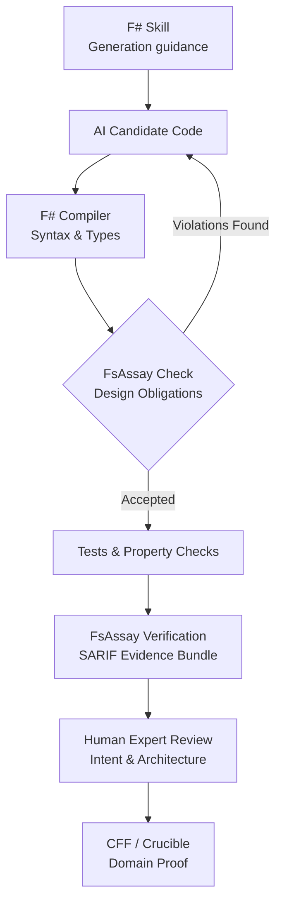

# FSharpAssay (FsAssay) 🧪

> **FsAssay is a compiler-backed F# design critic for humans and coding agents—strict about mechanical truth, explicit about architectural opinion, and honest about uncertainty.**

---

## ⚡ The Gist (TL;DR)

FsAssay bridges the gap between **compilable F#** and **idiomatic, architecture-compliant F#**:

- 🤖 **For AI Coding Agents**: Compiles ≠ Admissible. FsAssay catches C#-shaped code generation (mutability, `null`, unguarded `Option.get`, exception control-flow) and feeds deterministic `--fix` remediations back into the agent repair loop.
- 👤 **For Human Developers**: Acts as an automated senior F# architect, helping C#/Java engineers master Discriminated Unions, records, total functions, and domain modeling.
- 🏛 **Profile-Gated Boundaries**: Enforces zero-tolerance functional purity in domain cores (`core`) while permitting boundary interop (`interop`, `shell`, `script`).

> 📖 **A Skill is the textbook. FsAssay is the examiner.**  
> ⚙️ **The Compiler asks:** *"Does this compile?"*  
> 🧪 **FsAssay asks:** *"Did the candidate code follow the functional architecture this repository intended?"*

---

## 🧭 The 5W1H of FsAssay

| Question | Enterprise Real-World Answer |
| :--- | :--- |
| **What?** | A compiler-aware F# design critic that checks whether code merely compiles or genuinely follows the repository's functional architecture. |
| **Why?** | The F# compiler permits mutation, null, inheritance, partial functions, and mixed paradigms. Agents trained predominantly on C# will use them unless guided and checked. |
| **Who?** | AI coding agents first; F# newcomers second; senior F# reviewers, architects, and maintainers third. |
| **When?** | After every agent edit, before PR submission, during CI verification, and before evidence/release packaging. |
| **Where?** | Agent harness, CLI, IDE extension, CI pipeline, and training-data generation pipelines. |
| **How?** | Skills guide generation; compiler checks language correctness; FsAssay checks design obligations; tests check behavior; CFF/Crucible checks domain truth. |

---

## ⚡ Skills vs. FsAssay: Complementary Halves

Skills and FsAssay solve different halves of the agentic coding problem:

| Capability | F# Agent Skill | FsAssay Critic |
| :--- | :---: | :---: |
| **Tells the agent what good F# looks like** | Yes | Via diagnostic remediations (`--fix`) |
| **Prevents C#-shaped code generation** | Improves probability | Detects observable violations |
| **Can be ignored by the model** | Yes | Not when enforced by CI / Harness |
| **Understands resolved F# symbols** | No | Yes (via FCS / TAST) |
| **Produces machine-verifiable evidence** | No | Yes (OASIS SARIF v2.1.0) |
| **Measures architectural improvement** | Weakly | Yes (Grades S to F, Rate Cards) |
| **Provides training feedback** | Examples & instructions | Rejection labels & counterexamples |
| **Requires human interpretation** | Often | Deterministic rules: No; Contextual: Profile-gated |

> **"A Skill is the textbook. FsAssay is the examiner."**
> 
> *The compiler asks: "Does this compile?" FsAssay asks: "Did the agent produce the kind of F# this repository intended?"*

---

## 🏢 Real-World Enterprise Workout Example

Consider an AI agent building an order-processing service.

**The Skill instructs the agent:**
Use `OrderId` and `CustomerId` domain types • Model states using DUs • Return `Result` • Keep I/O in the shell • Avoid partial access and hidden exceptions.

**The Agent nevertheless generates:**
```fsharp
let processOrder (orderId: string) (customerId: string) =
    let customer = repository.find customerId |> Option.get
    let mutable total = 0m

    for item in customer.Items do
        total <- total + item.Price

    total
```

*This compiles cleanly, so the compiler cannot protect the architecture.*

**FsAssay responds at multi-level confidence:**
- ❌ **BLOCK (`FSA-C02` / `FSA1002`)**: Resolved call to `Option.get` creates an unguarded partial function.
- ❌ **BLOCK under `core` (`FSA1001`)**: Mutation (`let mutable`) is strictly forbidden in the functional core.
- ⚠️ **ADVISE (`FSA1004`)**: Two string parameters (`orderId: string`, `customerId: string`) indicate primitive blindness.
- 💡 **ADVISE (`FSA1007`)**: Iterative accumulation loop could be expressed idiomatically using `List.sumBy`.
- ❓ **INCONCLUSIVE (`FSA1301`)**: Direct `repository` access requires boundary profile verification (`shell` vs `core`).

Now the agent repairs the code in the background loop before a human reviewer sees it. The senior architect concentrates on concurrency, transaction semantics, and business correctness—not repetitive F# syntax correction.

---

## 📉 Human Review Overhead Reduction

| Review Category | Skills Only | Skills + Trustworthy FsAssay |
| :--- | :--- | :--- |
| **Basic F# Idiom Correction** | Reduced somewhat | **Largely Automated** |
| **Partial / Null / Mutation Filtering** | Human still verifies | **Mechanically Filtered** |
| **Repeated Agent Repair Cycles** | Prompt-driven | **Evidence-Driven (`--fix`)** |
| **Architecture Boundary Review** | Mostly human | **Pre-Classified by Profiles** |
| **Domain & Business Correctness** | Human | **Human Expert** |
| **Performance & Operational Design** | Human | **Human Expert** |

### 🎯 Initial Impact Targets
- **50–80%** reduction in repetitive idiom-review comments.
- **30–50%** reduction in agent repair cycles.
- **20–35%** reduction in total expert F# review time.
- **Substantial** improvement in code consistency across large multi-agent teams.

---

## 🔄 The Complete Agentic Verification Loop



---

## 🚀 The Dataset & Training Flywheel

FsAssay addresses the shortage of public F# training data in two ways:
1. **Short Term**: Corrects weak agent output today via deterministic feedback loops.
2. **Long Term**: Creates high-quality F# training datasets for tomorrow:

```
1. Collect Bad AI Candidates ──> 2. Record Exact FsAssay Findings ──> 3. Store Corrected F# Code
                                                                                 │
6. Keep FsAssay as Judge    <── 5. Fine-Tune / LoRA & Prompt Eval <── 4. Produce Accepted / Rejected Pairs
```

---

## 🎯 The Three Pillars of FsAssay

### 1. 🔍 Strict About Mechanical Truth
- **Compiler-Backed Precision**: Built directly on `FSharp.Compiler.Service` (FCS) and `FSharp.Analyzers.SDK`. Operates on typed AST (TAST) trees rather than crude text matching.
- **Exact Source Ranges**: Every finding points to exact line and column coordinates (`Range.StartLine`, `Range.StartColumn`) for seamless editor diagnostics.
- **Zero Comment & String False Positives**: Lexical comments and string literals containing reserved keywords (`mutable`, `null`, `while`) are automatically sanitized.

### 2. 🏛 Explicit About Architectural Opinion
- **Functional-First Profile Matrix**: Recognizes that real-world applications need pragmatism at boundaries while demanding total functional purity in core domains.
  - **`core`**: Zero-tolerance functional purity for core domain logic.
  - **`shell`**: Permits infrastructure and ORM persistence adapters (EF Core).
  - **`interop`**: Permits C# interop pragmatism (`mutable`, `null`, `ResizeArray`).
  - **`script`**: Permits `.fsx` scripting idioms (`while` loops, synchronous blocking).
  - **`performance`**: Permits measured local hot-path mutability.

### 3. ⚖️ Honest About Uncertainty
- **Four-State Verdict Kernel**: Classifies analysis outputs explicitly into `Pass`, `Fail`, `Inconclusive`, or `ToolFailure` with non-zero CLI exit codes.
- **SARIF v2.1.0 Evidence Bundles**: Exports standardized OASIS SARIF output alongside Markdown Rate Cards (Grades S–F) and Material Design 5 Dashboards.

---

## 📊 Complete Rule Catalogue Matrix (42/42 Verified Tests)

### 🔴 Tier 1: SOTA Correctness Rules (`FSA-C01` – `FSA-C08`)

| Rule ID | Rule Name | Description | Elite F# Alternative |
| :--- | :--- | :--- | :--- |
| **`FSA-C01`** | **`Unchecked.defaultof<_>`** | Using `Unchecked.defaultof<_>` outside interop boundary. | Return `Option<'T>` or proper discriminated union initialization. |
| **`FSA-C02`** | **Partial Access / `.Value`** | Calling `Option.get`, `.Value`, or `List.head` without guards. | Use pattern matching (`match opt with Some v -> ...`). |
| **`FSA-C03`** | **Async Blocking in Library** | Using `Async.RunSynchronously` inside reusable library code. | Flow `async { ... }` or `task { ... }` computation expressions. |
| **`FSA-C04`** | **Async Disposed Leak** | `use` resource bound before `Async.Start` finishes. | Pass `CancellationToken` or use `Async.StartImmediate`. |
| **`FSA-C05`** | **Incomplete DU Pattern Match** | Non-exhaustive pattern matching missing cases or wildcard `\| _ ->`. | Match all Discriminated Union cases explicitly. |
| **`FSA-C06`** | **Exceptions in Public API** | Throwing `failwith` / `raise` in public functions. | Return `Result<'T, 'Error>` error channels. |
| **`FSA-C07`** | **Non-Tail Recursion** | Self-referential recursive call in non-tail position. | Convert to tail-recursive accumulator or `Seq.fold`. |
| **`FSA-C08`** | **`Seq.length` on Infinite Seq** | Evaluating `Seq.length` on `Seq.initInfinite` or `Seq.unfold`. | Use `Seq.truncate` or bounded collection streams. |

---

### 🟠 Tier 2: SOTA Security & Guardrail Rules (`FSA-S01` – `FSA-S05`)

| Rule ID | Rule Name | Description | Elite F# Alternative |
| :--- | :--- | :--- | :--- |
| **`FSA-S01`** | **Hard-Coded Secrets** | Embedded API keys, AWS tokens (`AKIA...`), or passwords. | Inject credentials from environment variables or secret vaults. |
| **`FSA-S02`** | **Path Traversal** | Unsanitized file path input containing relative parent `..`. | Normalize and validate paths with `Path.GetFullPath`. |
| **`FSA-S03`** | **Swallowed Exceptions** | Empty `try ... with _ -> ()` or `with _ -> ignore()`. | Handle specific exceptions or propagate as `Error` results. |
| **`FSA-S04`** | **`async` Missing `return`** | `async { ... }` computation expression omitting explicit return. | Always end async blocks with explicit `return` or `return!`. |
| **`FSA-S05`** | **Task Blocking Calls** | Calling `.Result` or `.Wait()` on .NET `Task` instances. | Use `let! res = task |> Async.AwaitTask`. |

---

### 🟣 Tier 3: Pure Functional Physics (`FSA-F01` – `FSA-F07`)

| Rule ID | Rule Name | Description | Elite F# Alternative |
| :--- | :--- | :--- | :--- |
| **`FSA-F01`** | **No Throwing in Core** | Pure domain logic throwing exceptions. | Return `Result<'T, 'Error>`. |
| **`FSA-F02`** | **Total Pattern Matching** | Wildcard `_` matches masking missing DU cases. | Make cases explicitly exhaustive. |
| **`FSA-F03`** | **Result Binding Enforcement** | Imperative `if result.IsOk` checks. | Use `Result.bind` or `Result.map`. |
| **`FSA-F04`** | **No Implicit Unit Sequences** | Implicitly discarding side-effects (e.g. `printfn` returning `unit`). | Make bindings explicit or extract to shell. |
| **`FSA-F05`** | **Domain Signature Purity** | Exposed APIs returning `void` / `unit`. | Ensure inputs map to typed outputs. |
| **`FSA-F06`** | **Total Immutable Enforcement** | Modifying arrays or using `mutable` properties in core domain. | Use immutable copies. |
| **`FSA-F07`** | **Ban Classes in Domain** | OOP classes defined in domain logic. | Use Discriminated Unions and Records. |

---

### 🔵 Tier 4: Ecosystem & API Gatekeeper (`FSA-E01` – `FSA-E04`)

| Rule ID | Rule Name | Description | Elite F# Alternative |
| :--- | :--- | :--- | :--- |
| **`FSA-E01`** | **No Public Classes in API** | Exposing OOP classes/inheritance to consumers. | Expose pure F# functions and Records. |
| **`FSA-E02`** | **No Hidden Exceptions** | Throwing undocumented exceptions from APIs. | Expose `Result` types for errors. |
| **`FSA-E03`** | **No C# Delegates** | Forcing consumers to use `System.Action` / `System.Func`. | Use native F# arrow types (`'a -> 'b`). |
| **`FSA-E04`** | **No Leaked Mutability** | Exposing `Dictionary` or `ref` cells via properties. | Expose `Map` or read-only snapshots. |

---

### 🤖 Tier 5: Machine Learning & Boundary (`FSA-ML01`, `FSA-B01`)

| Rule ID | Rule Name | Description | Elite F# Alternative |
| :--- | :--- | :--- | :--- |
| **`FSA-ML01`** | **Raw Array Mutation in ML** | Mutating raw `float[]` in ML logic. | Use immutable pure Tensors. |
| **`FSA-ML02`** | **OOP Inheritance in ML** | Inheritance in model definitions. | Use composed DUs and Records. |
| **`FSA-B01`** | **Profile Boundary Violation** | Mutability outside of the `shell` profile. | Restrict side-effects to shell. |

---

### 🛡 Tier 6: The 10 Moat Rules (`FSA-M01` – `FSA-M10`)

These 10 rules form the **FsAssay Moat**. They exploit F#'s type system as a detection engine to catch semantic bugs that no regex or C# analyzer can see.

| Rule ID | Rule Name | Description | TAST Requirement |
| :--- | :--- | :--- | :--- |
| **`FSA-C05`** | **Incomplete DU Match** | DU match missing cases. | Resolve union cases |
| **`FSA-C04`** | **`use` + `Async.Start`** | `use` scope exiting before async runs. | Scope + async flow |
| **`FSA-C07`** | **Non-tail `let rec`** | Recursive call not in tail position. | Control flow position |
| **`FSA-C02`** | **`Option.get` in pipeline** | Unguarded `.get` without `filter`/`match`. | Type resolution |
| **`FSA-S04`** | **`async { }` without return** | Computed value is silently discarded. | CE desugaring |
| **`FSA-S05`** | **`Task.Result` in async** | Blocking `.Result` inside `async { }` deadlocks. | Enclosing CE scope |
| **`FSA-M01`** | **Struct DU Ref Fields** | `[<Struct>]` DU containing `string`/`list`. | Type + field traits |
| **`FSA-M02`** | **`[<RequireQualifiedAccess>]`** | Unqualified DU case access violation. | Attribute resolution |
| **`FSA-M03`** | **Unit-of-measure loss** | `float<m>` cast to bare `float`. | Erased measure types |
| **`FSA-M04`** | **Active Pattern Partiality** | `(\|A\|)` used in match without fallback. | Signature + pattern matching |

---

## 🦈 The Ecosystem Scanner (`FSA-ECO`)

FsAssay doesn't just lint local projects; it includes a weaponized CLI designed to hunt pure/impure F# repositories on GitHub.

```bash
# Scan any GitHub repository to grade its F# purity
dotnet run --project FsAssay.Scanner/FsAssay.Scanner.fsproj https://github.com/demystifyfp/FsToolkit.ErrorHandling
```

**Verdicts:**
- 🚨 **Shark**: Fails purity tests (heavy C# interop, `null`, unguarded access).
- 🐬 **Dolphin**: Passes Elite F# Checks (pure functions, total patterns).

---

## ✨ Roslyn Parity: Code Fixes & IDE Integration

FsAssay integrates natively into **Visual Studio Code (Ionide)** and **JetBrains Rider**.
Just like Roslyn `CodeFixProvider`s, FsAssay provides automatic IDE remediations for core violations:
- `isNull x` ➡️ `Option.isNone x`
- `Async.RunSynchronously` ➡️ `Async.AwaitTask`
- `use _ = Async.Start` ➡️ `use _ = Async.StartChild`

---

## 🛠 CLI Options & Quick-Fix Engine

```bash
# Run analysis on a solution or project
dotnet run --project FsAssay.Runner -- /path/to/solution.sln

# Automatically display inline --fix recommendations
dotnet run --project FsAssay.Runner -- /path/to/solution.sln --fix

# Export Markdown Rate Card (Grades S through F)
dotnet run --project FsAssay.Runner -- /path/to/solution.sln -r report.md

# Export Material Design 5 HTML Dashboard
dotnet run --project FsAssay.Runner -- /path/to/solution.sln -m dashboard.html

# Export OASIS SARIF v2.1.0 Evidence Bundle
dotnet run --project FsAssay.Runner -- /path/to/solution.sln --s results.sarif
```

---

## 🧪 Building & Running Tests

FsAssay enforces a zero-regression policy backed by Expecto:

```bash
# Execute full 42-test suite
dotnet run --project FsAssay.Tests
```

---

## 📚 Philosophy & Further Reading

- [Agentic AI & Enterprise Architecture Specification](docs/Agentic-Architecture.md)
- [Functional-First Architecture Specification](docs/Functional-First.md)
- [Qwen 5 SOTA Specification](docs/Qwen5.md)
- [Domain Modeling Made Functional](https://fsharpforfunandprofit.com/ddd/) by Scott Wlaschin

<!-- RULES_START -->
# FsAssay Rule Ledger

| Rule Code | Description | Status |
|---|---|---|
| FSA-C01 | Unchecked.defaultof<_> in Non-Interop Code | Implemented |
| FSA-C02 | Option.get / .Value Without Guard | Implemented |
| FSA-C03 | Async.RunSynchronously in Library Code | Implemented |
| FSA-C04 | IDisposable Disposed Before Async Runs | Delegated |
| FSA-C05 | Incomplete Pattern Match on DU | Delegated |
| FSA-C06 | failwith / invalidArg / raise in Public API | Implemented |
| FSA-C07 | Non-Tail Recursion in let rec | Proposed |
| FSA-C08 | Seq.length on Infinite Sequences | Implemented |
| FSA-C09 | Null Checking (isNull / = null) Instead of Option | Implemented |
| FSA-C10 | Mutable State Instead of Functional Constructs | Implemented |
| FSA-C11 | Use _.Property shorthand for lambdas (F# 8+) | Proposed |
| FSA-C12 | Use nested record updates (F# 8+) | Proposed |
| FSA-C13 | Missing [<TailCall>] attribute on recursive function | Proposed |
| FSA-C14 | Evasion: Use of ref cells or Dictionary to bypass mutability rules | Proposed |
| FSA-C15 | Catalogue Violation: Direct use of known effectful sink in core logic | Implemented |
| FSA-C16 | Catalogue Violation: Direct use of known mutable collection | Proposed |
| FSA-S01 | Hard-Coded Credentials / Secrets | Implemented |
| FSA-S02 | Path Traversal in File Operations | Implemented |
| FSA-S03 | Swallowed Exceptions | Implemented |
| FSA-S04 | async { ... } Missing return | Proposed |
| FSA-S05 | Task.Result / .Wait() Blocking Calls | Implemented |
| FSA-ML01 | Raw array mutation in core ML logic. Use pure Tensors. | Proposed |
| FSA-ML02 | OOP Inheritance in ML Model. Use pure DUs/Records. | Proposed |
| FSA-B01 | Mutable state / arrays detected outside 'shell' profile. | Proposed |
| FSA-1301 | EF Core DbContext leakage outside shell/oracle profile | Proposed |
| FSA-1402 | Argu ParseResults leakage outside cli/shell profile | Proposed |
| FSA-F01 | No Throwing in Core | Proposed |
| FSA-F02 | Total Pattern Matching | Proposed |
| FSA-F03 | Enforce Result Binding over Imperative Checks | Proposed |
| FSA-F04 | No Implicit Unit Sequences in Core | Implemented |
| FSA-F05 | Domain Signature Purity | Proposed |
| FSA-F06 | Total Immutable Enforcement | Proposed |
| FSA-F07 | Ban Classes in Domain | Proposed |
| FSA-F08 | Effectful or impure operation detected inside a computation expression | Implemented |
| FSA-E01 | No Public Classes/Inheritance in API | Proposed |
| FSA-E02 | No Hidden Exceptions in API | Proposed |
| FSA-E03 | No C# Delegates (Action/Func) in API | Proposed |
| FSA-E04 | No Leaked Mutability in API | Proposed |
| FSA-M01 | Struct DU contains reference fields | Proposed |
| FSA-M03 | Unit-of-measure loss via implicit cast | Proposed |
| FSA-M04 | Active pattern partiality without fallback | Proposed |
| FSA-AI10 | Magic numbers: numeric literals > 1 in non-test code | Implemented |
| FSA-AI07 | Overly Generic: more than 5 generic parameters in a function/method | Implemented |

## Summary
- **Implemented**: 16
- **Delegated**: 2
- **Proposed**: 25
- **Dummy**: 0
- **Prototype**: 0

<!-- RULES_END -->
