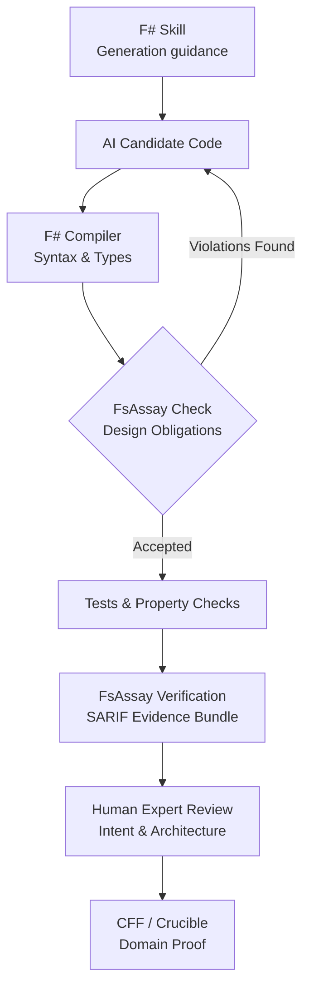

# 🤖 Agentic AI & Enterprise Architecture Specification: FsAssay

> **Public F# training data is significantly smaller than C# data. Consequently, AI agents naturally drift toward compilable but C#-shaped F#. FsAssay compensates for this data imbalance through an external, deterministic feedback loop.**

---

## 🧭 The 5W1H of FsAssay

| Question | Enterprise Real-World Answer |
| :--- | :--- |
| **What?** | A compiler-aware F# design critic that checks whether code merely compiles or genuinely follows the repository's functional architecture. |
| **Why?** | The F# compiler permits mutation, null, inheritance, partial functions, and mixed paradigms. Agents trained predominantly on C# will use them unless guided and checked. |
| **Who?** | AI coding agents first; F# newcomers second; senior F# reviewers, architects, and maintainers third. |
| **When?** | After every agent edit, before PR submission, during CI verification, and before evidence/release packaging. |
| **Where?** | Agent harness, CLI, IDE extension, CI pipeline, and training-data generation pipelines. |
| **How?** | Skills guide generation; compiler checks language correctness; FsAssay checks design obligations; tests check behavior; CFF/Crucible checks domain truth and evidence. |

---

## 📚 Skills vs. FsAssay: Complementary Halves

Skills and FsAssay solve different halves of the agentic coding problem:

| Capability | F# Agent Skill | FsAssay Critic |
| :--- | :---: | :---: |
| **Tells the agent what good F# looks like** | Yes | Via diagnostic remediations (`--fix`) |
| **Prevents C#-shaped code generation** | Improves probability | Detects observable violations |
| **Can be ignored by the model** | Yes | Not when enforced by CI / Harness |
| **Understands resolved F# symbols** | No | Yes (via FCS / TAST) |
| **Produces machine-verifiable evidence** | No | Yes (OASIS SARIF v2.1.0) |
| **Measures architectural improvement** | Weakly | Yes (Grades S to F, Rate Cards) |
| **Provides training feedback** | Examples & instructions | Rejection labels & counterexamples |
| **Requires human interpretation** | Often | Deterministic rules: No; Contextual: Profile-gated |

> **"A Skill is the textbook. FsAssay is the examiner."**
> 
> *The compiler asks: "Does this compile?" FsAssay asks: "Did the agent produce the kind of F# this repository intended?"*

---

## 🏢 Real-World Enterprise Workout Example

Consider an AI agent building an order-processing service.

**The Skill instructs the agent:**
1. Use `OrderId` and `CustomerId` single-case domain types.
2. Model lifecycle states using Discriminated Unions.
3. Return `Result<'T, 'Error>` error channels.
4. Keep I/O isolated in the infrastructure shell.
5. Avoid partial access (`Option.get`) and raw exceptions.

**The Agent nevertheless generates:**
```fsharp
let processOrder (orderId: string) (customerId: string) =
    let customer = repository.find customerId |> Option.get
    let mutable total = 0m

    for item in customer.Items do
        total <- total + item.Price

    total
```

**Why the Compiler Fails:**
This code **compiles cleanly**. The compiler cannot protect the architecture because imperative C# constructs are valid F# syntax.

**How FsAssay Responds (Multi-Level Confidence):**
- ❌ **BLOCK (`FSA-C02` / `FSA1002`)**: Resolved call to `Option.get` creates an unguarded partial function.
- ❌ **BLOCK under `core` (`FSA1001`)**: Mutation (`let mutable`) is strictly forbidden in the functional core.
- ⚠️ **ADVISE (`FSA1004`)**: Two string parameters (`orderId: string`, `customerId: string`) indicate primitive blindness.
- 💡 **ADVISE (`FSA1007`)**: Iterative accumulation loop could be expressed idiomatically using `List.sumBy`.
- ❓ **INCONCLUSIVE (`FSA1301`)**: Direct `repository` access requires boundary profile verification (`shell` vs `core`).

*Outcome*: The agent repairs the code automatically in the background loop before a human reviewer ever sees it. The senior architect concentrates on concurrency, transaction semantics, and business correctness—not repetitive F# syntax correction.

---

## 📉 Expert Review Overhead Reduction

FsAssay preserves expert developer attention for high-value tasks:

| Review Category | Skills Only | Skills + Trustworthy FsAssay |
| :--- | :--- | :--- |
| **Basic F# Idiom Correction** | Reduced somewhat | **Largely Automated** |
| **Partial / Null / Mutation Filtering** | Human still verifies | **Mechanically Filtered** |
| **Repeated Agent Repair Cycles** | Prompt-driven | **Evidence-Driven (`--fix`)** |
| **Architecture Boundary Review** | Mostly human | **Pre-Classified by Profiles** |
| **Domain & Business Correctness** | Human | **Human Expert** |
| **Performance & Operational Design** | Human | **Human Expert** |

### 🎯 Reasonable Target Impact Metrics
- **50–80%** reduction in repetitive idiom-review comments.
- **30–50%** reduction in agent repair cycles.
- **20–35%** reduction in total expert F# review time.
- **Substantial** improvement in code consistency across large multi-agent teams.

---

## 🔄 The Complete Agentic Verification Loop



---

## 🚀 The Dataset & Training Flywheel

FsAssay addresses the shortage of public F# training data in two ways:
1. **Short Term**: Corrects weak agent output today via deterministic feedback loops.
2. **Long Term**: Creates high-quality F# training datasets for tomorrow:

```
┌─────────────────┐     ┌──────────────────┐     ┌──────────────────┐
│ Collect Bad AI  │ ──> │  Record Exact    │ ──> │ Store Corrected  │
│   Candidates    │     │ FsAssay Findings │     │  F# Implementations
└─────────────────┘     └──────────────────┘     └────────┬─────────┘
                                                          │
┌─────────────────┐     ┌──────────────────┐              │
│ LoRA Fine-Tune  │ <── │ Accepted /       │ <────────────┘
│  & Agent Eval   │     │ Rejected Pairs   │
└─────────────────┘     └──────────────────┘
```

FsAssay remains the independent, objective judge before, during, and after model training.
