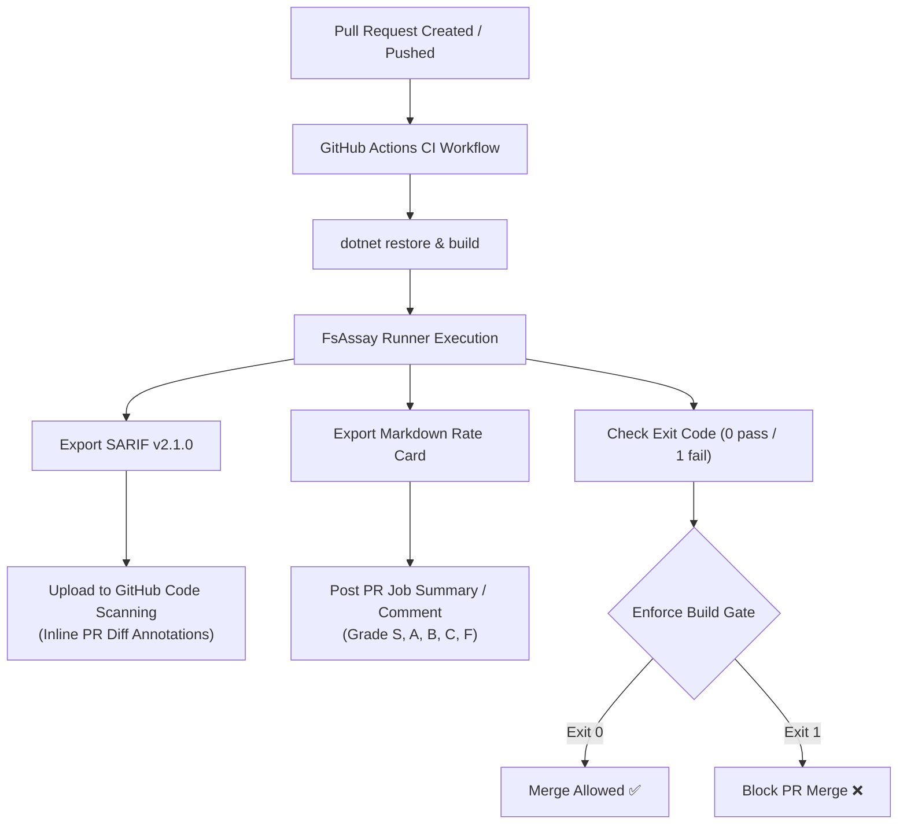

# 🔄 CI/CD Pipeline & GitHub Actions Integration Guide

> **FsAssay acts as an automated, compiler-backed quality gate in CI pipelines, preventing C#-shaped F# anti-patterns, security risks, and partial function crashes from entering production.**

---

## 🎯 CI/CD Integration Architecture



---

## 🚀 GitHub Actions Workflow (`.github/workflows/fsassay.yml`)

Create `.github/workflows/fsassay.yml` in your repository:

```yaml
name: FsAssay Architectural Audit

on:
  push:
    branches: [ main, develop ]
  pull_request:
    branches: [ main, develop ]

jobs:
  fsassay-audit:
    name: FsAssay Design Review & Security Audit
    runs-on: ubuntu-latest

    steps:
      - name: Checkout Source Code
        uses: actions/checkout@v4

      - name: Setup .NET SDK
        uses: actions/setup-dotnet@v4
        with:
          dotnet-version: '10.0.x'

      - name: Restore Dependencies
        run: dotnet restore FsAssay.sln

      - name: Build FsAssay Solution
        run: dotnet build FsAssay.sln -c Release --no-restore

      - name: Run FsAssay Audit Engine
        run: |
          dotnet run --project FsAssay.Runner -c Release -- \
            ./FsAssay.sln \
            --s results.sarif \
            -r ratecard.md \
            -m dashboard.html
        continue-on-error: true

      - name: Upload SARIF to GitHub Code Scanning
        uses: github/codeql-action/upload-sarif@v3
        with:
          sarif_file: results.sarif
          category: fsassay-architecture

      - name: Publish Markdown Rate Card to PR Job Summary
        run: cat ratecard.md >> $GITHUB_STEP_SUMMARY

      - name: Enforce FsAssay Quality Gate
        run: |
          dotnet run --project FsAssay.Runner -c Release -- ./FsAssay.sln
```

---

## 🛡️ Pre-Commit Hook Integration (`.git/hooks/pre-commit`)

Run FsAssay locally before commits are created:

```bash
#!/bin/sh
# .git/hooks/pre-commit

echo "🧪 Running FsAssay Local Pre-Commit Audit..."
dotnet run --project /root/fsharp/FsAssay.Runner -- ./FsAssay.sln --check

if [ $? -ne 0 ]; then
  echo "❌ FsAssay audit failed. Please fix architectural violations or apply --fix."
  exit 1
fi
```

---

## 📊 SARIF & Code Scanning Annotations

FsAssay exports standard **OASIS SARIF v2.1.0** format:
- **GitHub Security Tab**: All violations (`FSA-C01`–`FSA-C08`, `FSA-S01`–`FSA-S05`, `FSA1001`–`FSA1401`) are automatically indexed in the GitHub repository's Security tab.
- **PR Diff Annotations**: Developers see inline squiggles and explanations directly on their pull request line diffs in GitHub UI.
