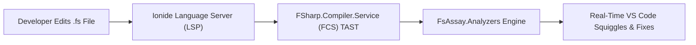

# 🎨 VS Code & Ionide Editor Integration Guide

> **FsAssay leverages `FSharp.Analyzers.SDK` (the F# ecosystem standard) to deliver real-time, in-editor diagnostics and code squiggles directly inside VS Code and Ionide.**

---

## ⚡ Live Editor Diagnostics Architecture



---

## 🚀 Step-by-Step VS Code Setup

### 1. Install Ionide Extension
Install the official **[Ionide-fsharp](https://marketplace.visualstudio.com/items?itemName=Ionide.Ionide-fsharp)** extension in VS Code.

### 2. Build the Analyzer Assembly
Build `FsAssay.Analyzers` in Debug or Release mode:
```bash
dotnet build FsAssay.Analyzers -c Release
```

### 3. Repository Configuration (`.vscode/settings.json`)
Ensure `.vscode/settings.json` points to your compiled `FsAssay.Analyzers.dll` directory:

```json
{
    "FSharp.enableAnalyzers": true,
    "FSharp.analyzersPath": [
        "./FsAssay.Analyzers/bin/Debug/net10.0",
        "./FsAssay.Analyzers/bin/Release/net10.0"
    ],
    "FSharp.smartIndent": true,
    "FSharp.pipelineHints.enabled": true,
    "editor.formatOnSave": true,
    "[fsharp]": {
        "editor.defaultFormatter": "Ionide.Ionide-fsharp",
        "editor.tabSize": 4,
        "editor.insertSpaces": true
    }
}
```

### 4. Reload VS Code
Run `Ctrl+Shift+P` (or `Cmd+Shift+P` on macOS) -> **Developer: Reload Window**.

Ionide will automatically load `FsAssay.Analyzers.dll`. As you type, violations like `FSA1001` (Mutation Overuse), `FSA1002` (Partial Access), `FSA-C01` (Unchecked.defaultof), and `FSA-S01` (Hard-coded Credentials) will highlight natively with red/yellow squiggles in your code editor!

---

## 🛠 VS Code Command Tasks (`Ctrl+Shift+B`)

FsAssay comes configured with VS Code workspace tasks in `.vscode/tasks.json`:
- **`dotnet: build`**: Builds the entire solution (`Ctrl+Shift+B`).
- **`FsAssay: Audit Solution`**: Runs full static analysis across all files.
- **`FsAssay: Auto-Fix Remediations`**: Displays `--fix` recommendations.
- **`FsAssay: Run Expecto Test Suite`**: Executes the 43-test Expecto test suite.

---

## 🛡️ Profile-Gated Suppressions in VS Code

Suppressions apply dynamically inside the editor:
- **`[<Profile("interop")>]`**: Suppresses mutation and null squiggles on C# boundary methods.
- **`[<Profile("shell")>]`**: Suppresses EF Core scope leak squiggles on infrastructure layers.
- **`[<Profile("script")>]`**: Suppresses loop and synchronous blocking squiggles in `.fsx` files.
